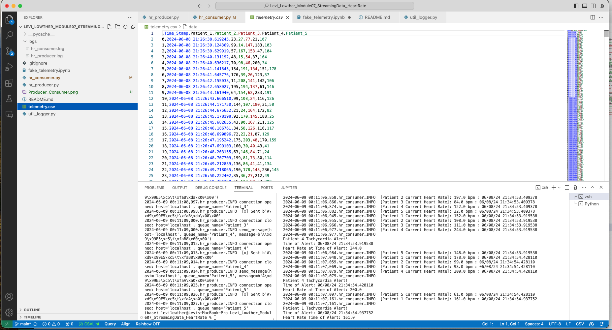
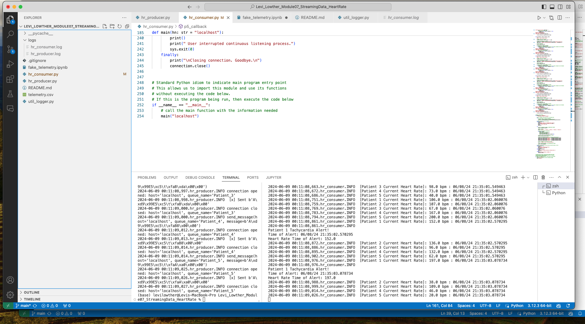
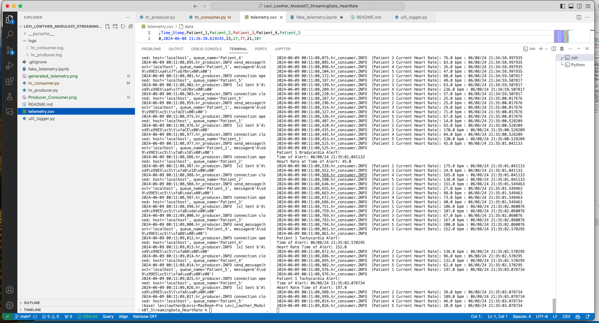
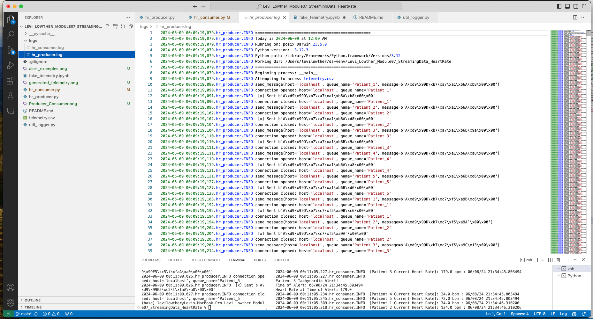
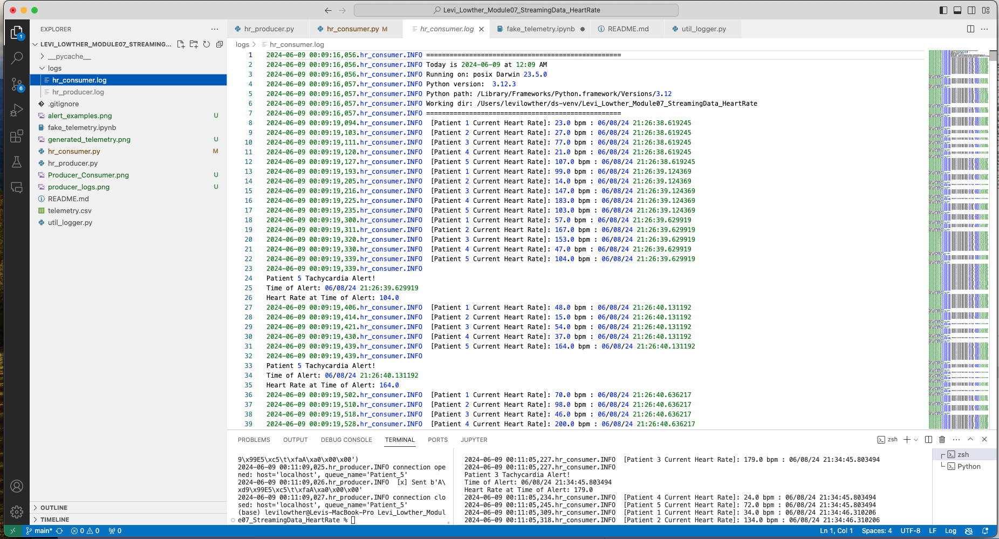

# Levi_Lowther_Module07_StreamingData_HeartRate
>Final Project for Streaming Data: Hear Rate Monitor and Alert System

>Hello there! The goal of this project is to create a producer and consumer of data that reads heart 
>rate telementry data from a cvs, and sends alerts based on the hear rates of patients. 
>A system like this could help health care providers keep an eye on patients that are at high risk for hear failure

## Requirements
 > RabbitMQ server running pika installed in your active environment RabbitMQ Admin See http://localhost:15672/Links to an external site.
 > Python 3.12

## Create Telemetry Data
>The telemetry data used in this project was generated using the Faker library. 
> more info about Faker can be found here: https://fakerjs.dev/guide/usage.html 
> A useful tutorial on how to use Faker: https://www.youtube.com/watch?v=VJAEMZt_Uh0&ab_channel=EnterpriseDNA

### Screenshot of generated data displayed in VS Code

## Creating the Producer
>The producer establishes a connection to RabbitMQ using the pika library.
>It then reads the telemetry.csv, line by line, and sends messages to queues based on the 
>patient it was generated for. 

## Creating Consumer
>This consumer has mutiple listening queues. While running it is always listening 
>for messages sent to the open queues. 
>Callbacks were created for each of the queues that could recieve a message. 
>these callbacks included parameters to send Alerts if the heart rate of the patient dropped 
>below 50 bpm (bradycardia) or rose above 100 bpm(tachycardia) for three consecutive reading. 

### Example of Producer and consumer working simultaneously

### Examples of Tachycardia and Bradycardia Alarm

## Logging
>Logger was used to keep track of the work that the producer and consumer were doing. 

### Producer Log

### Consumer Log

## Resources

>For date/time work:
>https://docs.python.org/3/library/datetime.html#datetime.time.microsecond

>For Faker:
>https://fakerjs.dev/

> For a better understanding of callback functions:
>https://www.askpython.com/python/built-in-methods/callback-functions-in-python 

> For general coding questions and debugging
> https://chatgpt.com/ 

